# Diagramme de cas d'utilisation - DentiFlow

Ce document presente le diagramme de cas d'utilisation principal de la plateforme DentiFlow.

Le code PlantUML du diagramme se trouve dans le fichier :

```text
docs/diagramme-cas-utilisation-dentiflow.puml
```

## Description generale

DentiFlow est une plateforme web de gestion de cabinet dentaire. Le systeme couvre les principaux besoins fonctionnels d'une clinique dentaire : authentification, gestion des patients, gestion des rendez-vous, salle d'attente en temps reel, traitements dentaires, administration et notifications.

Le diagramme met en evidence cinq acteurs principaux :

- Patient
- Secretaire
- Medecin dentiste
- Assistant dentaire
- Administrateur

Chaque acteur accede uniquement aux fonctionnalites correspondant a son role. Toutes les actions sensibles passent par une authentification et un controle des droits d'acces.

## Acteurs

### Patient

Le patient peut creer un compte, se connecter, consulter les disponibilites, reserver un rendez-vous en ligne, recevoir une confirmation ou un rappel, consulter ses rendez-vous et acceder a son historique medical.

### Secretaire

La secretaire gere les operations quotidiennes de la clinique. Elle peut gerer les patients, les rendez-vous, la salle d'attente, les documents, les assurances et les notifications.

### Medecin dentiste

Le medecin dentiste consulte son planning, suit la file d'attente en temps reel, accede au dossier clinique du patient, ajoute les diagnostics et traitements, confirme les actes dentaires et cloture les visites.

### Assistant dentaire

L'assistant dentaire consulte la file d'attente et le dossier du patient. Il peut saisir des actes dentaires, ajouter des notes ou pieces jointes cliniques, puis preparer les informations pour validation par le medecin.

### Administrateur

L'administrateur configure la clinique, gere le personnel, les roles, les permissions, les horaires de travail, le catalogue des actes dentaires, les prestataires d'assurance et les modeles d'assurance. Il peut aussi consulter le tableau de bord.

## Relations principales

Le cas d'utilisation « Se connecter » inclut la verification des droits d'acces. Cette relation montre que l'acces aux fonctionnalites depend du role de l'utilisateur.

La reservation d'un rendez-vous en ligne inclut la consultation des disponibilites, la prevention des conflits de creneaux et l'envoi d'une confirmation.

La gestion de la salle d'attente inclut le marquage d'un patient comme arrive, le changement de son statut et la consultation de la file d'attente en temps reel.

## Code PlantUML

```plantuml
@startuml
title Diagramme de cas d'utilisation - DentiFlow

left to right direction
skinparam packageStyle rectangle
skinparam actorStyle awesome
skinparam shadowing false

actor "Patient" as Patient
actor "Secretaire" as Secretaire
actor "Medecin dentiste" as Medecin
actor "Assistant dentaire" as Assistant
actor "Administrateur" as Admin

rectangle "DentiFlow" {

  package "Authentification" {
    usecase "Creer un compte" as UC_Register
    usecase "Se connecter" as UC_Login
    usecase "Se deconnecter" as UC_Logout
    usecase "Verifier les droits d'acces" as UC_RBAC
  }

  package "Gestion des patients" {
    usecase "Gerer les patients" as UC_ManagePatients
    usecase "Creer un dossier patient" as UC_CreatePatient
    usecase "Modifier un dossier patient" as UC_UpdatePatient
    usecase "Rechercher un patient" as UC_SearchPatient
    usecase "Consulter un dossier patient" as UC_ViewPatient
    usecase "Supprimer ou restaurer un patient" as UC_DeletePatient
    usecase "Gerer les documents patient" as UC_PatientDocs
    usecase "Gerer les assurances patient" as UC_PatientInsurance
    usecase "Consulter l'historique medical" as UC_MedicalHistory
  }

  package "Gestion des rendez-vous" {
    usecase "Consulter les disponibilites" as UC_ViewSlots
    usecase "Reserver un rendez-vous en ligne" as UC_BookOnline
    usecase "Gerer les rendez-vous" as UC_ManageAppointments
    usecase "Ajouter un rendez-vous" as UC_CreateAppointment
    usecase "Modifier un rendez-vous" as UC_UpdateAppointment
    usecase "Annuler un rendez-vous" as UC_CancelAppointment
    usecase "Consulter le planning" as UC_ViewSchedule
    usecase "Prevenir les conflits de creneaux" as UC_PreventConflicts
  }

  package "Salle d'attente" {
    usecase "Gerer la file d'attente" as UC_ManageQueue
    usecase "Marquer un patient comme arrive" as UC_CheckIn
    usecase "Changer le statut du patient" as UC_UpdateQueueStatus
    usecase "Consulter la file d'attente en temps reel" as UC_ViewQueue
  }

  package "Gestion des traitements" {
    usecase "Consulter le dossier clinique" as UC_ViewClinicalRecord
    usecase "Consulter le schema dentaire" as UC_DentalChart
    usecase "Ajouter un diagnostic" as UC_AddDiagnosis
    usecase "Saisir un acte dentaire" as UC_AddTreatment
    usecase "Ajouter des notes ou pieces jointes" as UC_AddClinicalNotes
    usecase "Confirmer les actes dentaires" as UC_ConfirmTreatment
    usecase "Cloturer une visite" as UC_CloseVisit
  }

  package "Administration" {
    usecase "Gerer le personnel" as UC_ManageStaff
    usecase "Gerer les roles et permissions" as UC_ManageRoles
    usecase "Configurer la clinique" as UC_ClinicConfig
    usecase "Configurer les horaires de travail" as UC_WorkingHours
    usecase "Gerer le catalogue des actes" as UC_ActCatalog
    usecase "Gerer les prestataires d'assurance" as UC_InsuranceProviders
    usecase "Gerer les modeles d'assurance" as UC_InsuranceTemplates
    usecase "Consulter le tableau de bord" as UC_Dashboard
  }

  package "Notifications" {
    usecase "Recevoir une confirmation de rendez-vous" as UC_Confirmation
    usecase "Recevoir un rappel de rendez-vous" as UC_Reminder
    usecase "Envoyer des notifications" as UC_SendNotifications
  }
}

Patient --> UC_Register
Patient --> UC_Login
Patient --> UC_Logout
Patient --> UC_ViewSlots
Patient --> UC_BookOnline
Patient --> UC_ViewSchedule
Patient --> UC_ViewPatient
Patient --> UC_MedicalHistory
Patient --> UC_Confirmation
Patient --> UC_Reminder

Secretaire --> UC_Login
Secretaire --> UC_Logout
Secretaire --> UC_ManagePatients
Secretaire --> UC_ManageAppointments
Secretaire --> UC_ManageQueue
Secretaire --> UC_SendNotifications

Medecin --> UC_Login
Medecin --> UC_Logout
Medecin --> UC_ViewSchedule
Medecin --> UC_ViewQueue
Medecin --> UC_ViewClinicalRecord
Medecin --> UC_DentalChart
Medecin --> UC_AddDiagnosis
Medecin --> UC_AddTreatment
Medecin --> UC_ConfirmTreatment
Medecin --> UC_CloseVisit

Assistant --> UC_Login
Assistant --> UC_Logout
Assistant --> UC_ViewQueue
Assistant --> UC_ViewClinicalRecord
Assistant --> UC_AddTreatment
Assistant --> UC_AddClinicalNotes

Admin --> UC_Login
Admin --> UC_Logout
Admin --> UC_Dashboard
Admin --> UC_ManageStaff
Admin --> UC_ManageRoles
Admin --> UC_ClinicConfig
Admin --> UC_WorkingHours
Admin --> UC_ActCatalog
Admin --> UC_InsuranceProviders
Admin --> UC_InsuranceTemplates
Admin --> UC_ManagePatients
Admin --> UC_ManageAppointments

UC_Register ..> UC_RBAC : <<include>>
UC_Login ..> UC_RBAC : <<include>>

UC_ManagePatients ..> UC_CreatePatient : <<include>>
UC_ManagePatients ..> UC_UpdatePatient : <<include>>
UC_ManagePatients ..> UC_SearchPatient : <<include>>
UC_ManagePatients ..> UC_ViewPatient : <<include>>
UC_ManagePatients ..> UC_DeletePatient : <<include>>
UC_ManagePatients ..> UC_PatientDocs : <<include>>
UC_ManagePatients ..> UC_PatientInsurance : <<include>>

UC_BookOnline ..> UC_ViewSlots : <<include>>
UC_BookOnline ..> UC_PreventConflicts : <<include>>
UC_BookOnline ..> UC_Confirmation : <<include>>

UC_ManageAppointments ..> UC_CreateAppointment : <<include>>
UC_ManageAppointments ..> UC_UpdateAppointment : <<include>>
UC_ManageAppointments ..> UC_CancelAppointment : <<include>>
UC_ManageAppointments ..> UC_ViewSchedule : <<include>>
UC_CreateAppointment ..> UC_PreventConflicts : <<include>>
UC_CreateAppointment ..> UC_SendNotifications : <<include>>

UC_ManageQueue ..> UC_CheckIn : <<include>>
UC_ManageQueue ..> UC_UpdateQueueStatus : <<include>>
UC_ManageQueue ..> UC_ViewQueue : <<include>>

UC_AddTreatment ..> UC_ViewClinicalRecord : <<include>>
UC_ConfirmTreatment ..> UC_AddTreatment : <<extend>>
UC_CloseVisit ..> UC_ConfirmTreatment : <<include>>

UC_ClinicConfig ..> UC_WorkingHours : <<include>>
UC_SendNotifications ..> UC_Confirmation : <<include>>
UC_SendNotifications ..> UC_Reminder : <<include>>

@enduml
```


