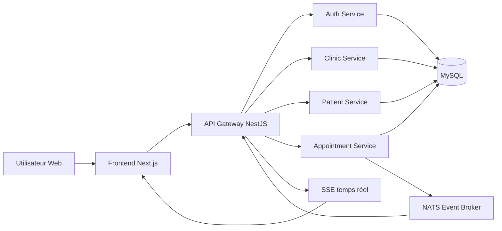
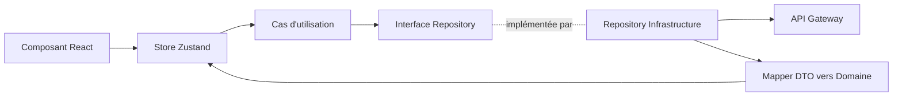
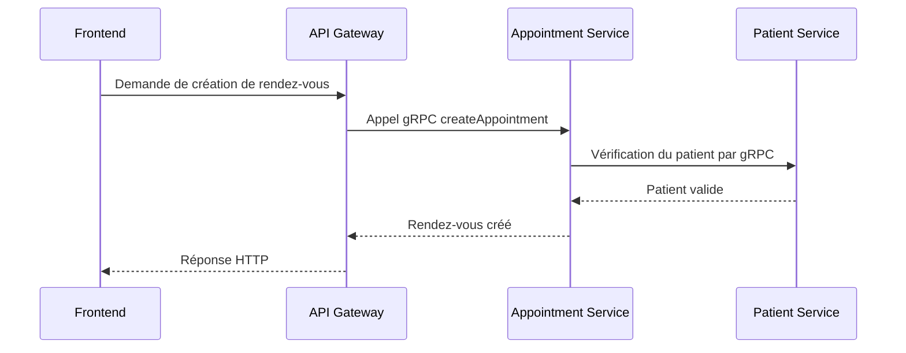
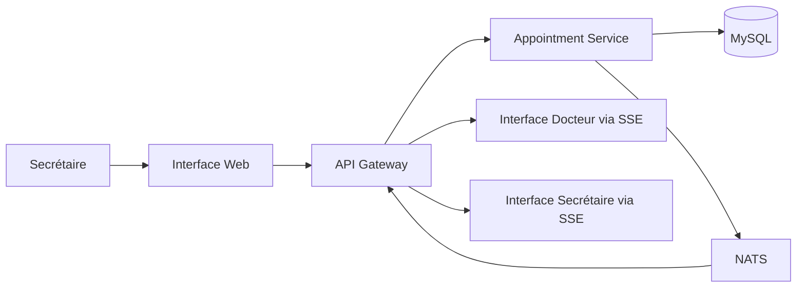
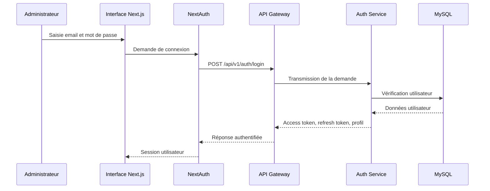
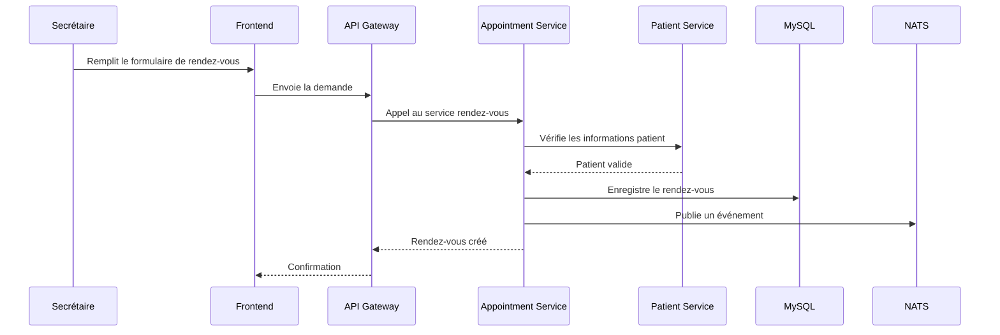

# Chapitre 3

# Conception de l'architecture du système DentiFlow

## Introduction

Dans ce chapitre, nous présentons la conception technique adoptée pour la plateforme DentiFlow. Après l'analyse des besoins fonctionnels et non fonctionnels, il était nécessaire de choisir une architecture capable de supporter plusieurs contraintes importantes : la gestion de plusieurs profils utilisateurs, la protection des données médicales, la synchronisation en temps réel de la salle d'attente, ainsi que l'évolution progressive de la plateforme vers un produit SaaS complet.

Le projet DentiFlow ne se limite pas à une simple application de prise de rendez-vous. Il vise à couvrir le fonctionnement quotidien d'un cabinet dentaire : inscription et suivi des patients, gestion des rendez-vous, file d'attente, actes dentaires, personnel, authentification et administration. Pour cette raison, nous avons adopté une architecture moderne basée sur un monorepo, un frontend Next.js structuré selon les principes de la Clean Architecture, et un backend composé de microservices NestJS communiquant à travers une API Gateway, gRPC et NATS.

L'objectif de ce chapitre est donc de décrire les choix architecturaux, la structure globale de la solution, les responsabilités des différents modules, ainsi que les mécanismes de communication entre les composants.

## 1. Sprint de conception de l'architecture

### 1.1 Backlog du sprint

Le sprint de conception avait pour objectif de préparer le socle technique de la plateforme avant l'implémentation complète des fonctionnalités métier. Les tâches principales sont résumées dans le tableau suivant.

| ID | Tâche | Estimation |
| --- | --- | --- |
| 1 | En tant que développeur, je veux définir l'architecture globale de DentiFlow afin de séparer clairement le frontend, le backend et les services métier. | 4 jours |
| 2 | En tant que développeur, je veux mettre en place une architecture frontend maintenable avec Next.js, TypeScript et Clean Architecture. | 5 jours |
| 3 | En tant que développeur, je veux préparer une architecture backend basée sur NestJS et des microservices indépendants. | 6 jours |
| 4 | En tant que développeur, je veux définir les mécanismes de communication entre les services avec REST, gRPC et NATS. | 4 jours |
| 5 | En tant que développeur, je veux préparer l'environnement Docker pour faciliter l'exécution locale des services. | 3 jours |

La réalisation de ce sprint peut être présentée en trois grandes parties :

- Mise en place du socle frontend Next.js.
- Mise en place du socle backend NestJS en microservices.
- Préparation de l'infrastructure locale avec Docker, MySQL et NATS.

## 2. Architecture générale de DentiFlow

### 2.1 Choix d'une architecture microservices

Une architecture monolithique aurait permis de développer rapidement une première version de l'application. Cependant, dans le contexte de DentiFlow, cette approche aurait rapidement montré ses limites. Les domaines fonctionnels sont nombreux et possèdent chacun leurs propres règles : authentification, gestion des cliniques, patients, rendez-vous, traitements, notifications et file d'attente.

Nous avons donc choisi une architecture microservices afin de séparer les responsabilités et de permettre à chaque service d'évoluer de manière plus indépendante. Chaque microservice possède son propre domaine métier, ses propres modules internes et, lorsque nécessaire, sa propre base de données.

Cette architecture apporte plusieurs avantages :

- une meilleure maintenabilité grâce à la séparation des domaines ;
- une évolution plus simple des fonctionnalités ;
- une isolation des erreurs entre les services ;
- une meilleure préparation à la montée en charge ;
- une organisation plus claire du code dans un projet de grande taille.

Le tableau suivant présente une comparaison simplifiée entre les architectures possibles.

| Critère | Architecture monolithique | Architecture modulaire | Architecture microservices |
| --- | --- | --- | --- |
| Couplage | Fort | Moyen | Faible |
| Déploiement | Global | Global ou partiel | Indépendant par service |
| Maintenance | Difficile à long terme | Moyenne | Plus simple par domaine |
| Scalabilité | Toute l'application | Par module logique | Par service |
| Adaptation à DentiFlow | Limitée | Acceptable | Très adaptée |

### 2.2 Vue globale de la solution

L'application est organisée sous forme de monorepo. Ce choix permet de conserver dans un même dépôt le frontend, les services backend, les fichiers Docker, les scripts de test et la documentation technique. Cela facilite la cohérence du projet tout en gardant des frontières claires entre les différentes parties.



L'utilisateur interagit uniquement avec l'interface web. Le frontend ne communique pas directement avec les microservices internes. Toutes les requêtes passent par l'API Gateway, qui joue le rôle de point d'entrée unique, vérifie l'authentification et redirige les demandes vers le service concerné.

## 3. Socle frontend Next.js

### 3.1 Choix de Next.js et TypeScript

Le frontend de DentiFlow est développé avec Next.js, React et TypeScript. Next.js a été choisi car il offre une structure moderne basée sur l'App Router, une bonne gestion des routes, une compatibilité avec le rendu côté serveur et une excellente intégration avec les applications web complexes.

TypeScript permet de renforcer la qualité du code en ajoutant un typage statique. Dans une application médicale où les données manipulées sont sensibles, cette sécurité supplémentaire réduit les erreurs liées aux structures de données, aux appels API et aux transformations entre objets métier et objets de transport.

Les principales technologies utilisées dans la partie frontend sont :

| Technologie | Rôle dans le projet |
| --- | --- |
| Next.js | Framework React pour l'application web |
| React | Construction des composants d'interface |
| TypeScript | Typage statique du code |
| Tailwind CSS | Mise en page et styles utilitaires |
| Material UI | Composants d'interface avancés |
| Zustand | Gestion d'état côté client |
| NextAuth | Gestion de session et authentification côté frontend |
| next-intl | Internationalisation de l'application |
| Three.js / React Three Fiber | Visualisation 3D du schéma dentaire |

### 3.2 Organisation du frontend

La partie frontend respecte une architecture en couches inspirée de la Clean Architecture. Cette organisation évite que les composants React contiennent directement la logique métier ou les appels HTTP. Chaque couche possède une responsabilité précise.

```text
frontend/src/
├── app/
├── domain/
├── application/
├── infrastructure/
├── presentation/
└── shared/
```

La couche `domain` contient les entités métier et les interfaces des repositories. Elle ne dépend d'aucun framework. Par exemple, les entités relatives aux patients, aux rendez-vous, à la file d'attente ou aux traitements sont définies dans cette couche.

La couche `application` contient les cas d'utilisation. Elle décrit les actions que l'application peut exécuter, comme créer un patient, rechercher des patients, modifier un rendez-vous ou changer le statut d'un patient dans la salle d'attente.

La couche `infrastructure` contient les implémentations concrètes : clients HTTP, repositories, mappers, configuration NextAuth, thème, internationalisation et conteneurs d'injection.

La couche `presentation` contient les pages visuelles, composants React, stores Zustand et hooks utilisés par l'interface utilisateur.

Cette séparation rend le code plus lisible et plus facile à tester. Par exemple, un composant d'interface n'a pas besoin de connaître l'adresse de l'API. Il déclenche une action dans un store, qui appelle un cas d'utilisation, qui lui-même utilise un repository.

### 3.3 Flux de données côté frontend

Le flux de données suit une direction claire afin d'éviter les dépendances circulaires.



Cette approche est appliquée dans plusieurs modules du projet, notamment l'authentification administrateur, la gestion des patients, les rendez-vous, la salle d'attente et le module de traitement dentaire.

### 3.4 Internationalisation et support RTL

DentiFlow vise un contexte Maghreb et MENA. L'application doit donc fonctionner en français, en anglais et en arabe. Le support de l'arabe ne se limite pas à traduire les textes : l'interface doit aussi s'adapter à l'écriture de droite à gauche.

Pour cela, l'application utilise une configuration de locale dans les routes Next.js, des fichiers de messages séparés et une gestion du sens d'affichage à travers le thème et les caches Emotion. Cette décision permet d'avoir une interface cohérente en LTR pour le français et l'anglais, et en RTL pour l'arabe.

## 4. Socle backend NestJS

### 4.1 Choix de NestJS

Le backend est développé avec NestJS, un framework Node.js basé sur TypeScript. NestJS a été retenu car il propose une structure modulaire, une intégration naturelle avec les microservices, les guards, les interceptors, la validation des DTOs et la programmation orientée dépendances.

Dans DentiFlow, NestJS est utilisé pour construire l'API Gateway et les microservices métier. Chaque service est organisé autour des mêmes principes : une couche domaine, une couche application, une couche infrastructure et une couche présentation.

Les principales technologies backend sont :

| Technologie | Rôle dans le projet |
| --- | --- |
| NestJS | Framework backend |
| TypeScript | Langage principal |
| MySQL | Base de données relationnelle |
| TypeORM | Mapping objet-relationnel et migrations |
| gRPC | Communication synchrone entre services |
| NATS | Communication asynchrone par événements |
| JWT / Passport | Authentification et protection des routes |
| Joi / class-validator | Validation de configuration et des données |
| Docker | Conteneurisation des services |

### 4.2 Organisation des microservices

Le dossier `services` regroupe les services backend. Les services actuellement présents dans le projet sont :

| Service | Responsabilité principale |
| --- | --- |
| api-gateway | Point d'entrée unique de l'application, routage, authentification, SSE |
| auth-service | Authentification, inscription, génération et validation des tokens |
| clinic-service | Gestion des informations liées à la clinique et à son organisation |
| patient-service | Gestion des patients, documents et assurances |
| appointment-service | Gestion des rendez-vous, planning et file d'attente |
| treatment-service | Base du module de traitements dentaires |
| notification-service | Préparation des notifications et communications |
| lib | Bibliothèque partagée : configuration, base de données, logger et contrats |

Chaque service est conçu pour rester responsable de son propre domaine. Par exemple, le service patient gère les données patients, tandis que le service rendez-vous ne doit pas accéder directement à la base de données du service patient. Lorsqu'il a besoin d'une information patient, il communique avec le service concerné à travers un contrat défini.

### 4.3 Structure interne d'un service

Les services suivent une structure proche de la Clean Architecture.

```text
service-name/src/
├── domain/
├── application/
├── infrastructure/
├── presentation/
├── app.module.ts
└── main.ts
```

La couche `domain` contient les entités métier, les enums et les interfaces de repository. La couche `application` contient les cas d'utilisation et ports nécessaires à l'exécution des règles métier. La couche `infrastructure` contient les implémentations techniques comme TypeORM, les clients gRPC et NATS. Enfin, la couche `presentation` contient les contrôleurs REST ou gRPC exposés par le service.

Cette organisation permet de garder la logique métier indépendante du framework et de la base de données.

## 5. API Gateway

### 5.1 Rôle de la Gateway

Dans une architecture microservices, il est déconseillé d'exposer tous les services directement au frontend. Cela compliquerait la sécurité, le routage, la gestion des erreurs et l'évolution de l'application. Pour cette raison, DentiFlow utilise une API Gateway.

L'API Gateway est le point d'entrée principal de l'application. Elle reçoit les requêtes HTTP du frontend, vérifie les tokens JWT, applique les règles d'autorisation et transmet la demande au microservice approprié.

Elle permet aussi de centraliser certains aspects transverses :

- authentification JWT ;
- contrôle des rôles ;
- vérification du périmètre clinique ;
- routage vers les services internes ;
- diffusion SSE des événements temps réel ;
- exposition des endpoints de santé.

### 5.2 Protection des routes

La sécurité repose sur l'utilisation de JWT. Après authentification, l'utilisateur reçoit un token contenant les informations nécessaires, comme son identifiant, son rôle et son contexte clinique. Les routes sensibles sont protégées par des guards NestJS.

Cette approche est importante car DentiFlow manipule des informations médicales et administratives. L'accès aux données doit donc être limité selon le rôle de l'utilisateur : administrateur, secrétaire, docteur, assistant ou patient.

## 6. Communication entre les services

### 6.1 Communication synchrone avec gRPC

La communication synchrone est utilisée lorsqu'un service a besoin d'une réponse immédiate d'un autre service. Par exemple, le service des rendez-vous peut avoir besoin de vérifier l'existence d'un patient ou d'une clinique avant de créer un rendez-vous.

Pour ce type d'échange, DentiFlow utilise gRPC. Les contrats sont définis dans des fichiers `.proto`, puis générés en TypeScript afin de garantir une communication typée entre les services.



L'utilisation de gRPC permet de réduire les ambiguïtés entre services et de conserver une communication plus stricte que de simples appels HTTP internes.

### 6.2 Communication asynchrone avec NATS

Certaines actions ne doivent pas bloquer la réponse principale envoyée à l'utilisateur. Par exemple, après la création d'un rendez-vous ou le changement d'état d'un patient dans la file d'attente, il peut être nécessaire d'envoyer un événement à d'autres parties du système.

Pour cela, DentiFlow utilise NATS comme broker d'événements. Les services publient des événements, et les consommateurs intéressés peuvent réagir sans créer de dépendance directe forte entre eux.

Cette approche est particulièrement utile pour :

- la synchronisation de la salle d'attente ;
- les notifications ;
- les futurs journaux d'audit ;
- les traitements secondaires qui ne doivent pas ralentir l'expérience utilisateur.

## 7. Gestion de la persistance

### 7.1 Choix de MySQL

MySQL a été choisi comme système de gestion de base de données. Dans le contexte de DentiFlow, les données sont fortement structurées : patients, rendez-vous, cliniques, actes, utilisateurs et paiements futurs. Une base relationnelle correspond donc bien au besoin.

MySQL permet également de mieux gérer les contraintes d'intégrité, les transactions et les relations entre les données. Ces éléments sont importants pour une application qui traite des informations administratives et médicales.

### 7.2 TypeORM et migrations

TypeORM est utilisé pour mapper les entités persistées vers les tables MySQL. Les changements de structure sont gérés par des migrations, ce qui permet de versionner l'évolution de la base de données.

Dans le projet, les services disposent de scripts de migration. Cette pratique évite les modifications manuelles non contrôlées et facilite le passage d'un environnement de développement à un environnement de production.

### 7.3 Isolation par service

Chaque service est conçu pour être propriétaire de ses données. Dans l'environnement Docker de développement, plusieurs bases sont préparées, comme `auth_db`, `clinic_db`, `patient_db` et `appointment_db`. Cette séparation prépare le projet à une architecture SaaS plus évolutive, où les domaines peuvent être déployés et maintenus indépendamment.

## 8. Temps réel et salle d'attente

La salle d'attente est l'une des fonctionnalités importantes de DentiFlow. Dans un cabinet dentaire, le statut d'un patient change au cours de sa visite : arrivé, en attente, en consultation, terminé. Ces changements doivent être visibles rapidement par le secrétariat, le médecin et l'assistant.

Pour répondre à ce besoin, l'architecture utilise un modèle combinant REST, NATS et SSE :

- les actions utilisateur sont envoyées à travers des endpoints REST ;
- les changements métier sont publiés comme événements NATS ;
- l'API Gateway reçoit les événements et les diffuse au frontend avec SSE.



Cette conception évite au frontend d'interroger constamment le serveur. Les mises à jour sont poussées vers les écrans concernés, ce qui améliore la réactivité de l'application.

## 9. Déploiement local avec Docker

Pour faciliter le développement, DentiFlow utilise Docker Compose. L'environnement local contient les composants nécessaires au fonctionnement du backend :

- MySQL pour la persistance ;
- NATS pour les événements ;
- API Gateway ;
- Auth Service ;
- Clinic Service ;
- Patient Service ;
- Appointment Service.

Chaque service est exécuté dans un conteneur séparé, avec des variables d'environnement dédiées. Les ports internes gRPC sont également configurés afin de permettre la communication entre les services.

Cette approche présente plusieurs avantages :

- installation plus simple de l'environnement ;
- exécution reproductible entre les machines ;
- séparation claire entre les services ;
- possibilité de tester les communications réelles entre composants.

## 10. Sécurité et contrôle d'accès

La sécurité est un point central dans DentiFlow. Le système manipule des données personnelles et médicales, ce qui impose une gestion stricte de l'accès.

Les principaux mécanismes prévus sont :

- authentification par email et mot de passe ;
- génération de tokens JWT ;
- validation des tokens au niveau de l'API Gateway ;
- rôles utilisateurs pour limiter les actions autorisées ;
- séparation des données par contexte clinique ;
- validation des entrées côté backend ;
- journalisation structurée des événements importants.

Le rôle de l'utilisateur influence directement les écrans et les actions disponibles. Par exemple, un administrateur peut gérer le personnel, tandis qu'un utilisateur patient ne doit accéder qu'à ses propres informations et rendez-vous.

## 11. Diagramme de séquence : authentification administrateur

Le scénario suivant illustre le fonctionnement général de l'authentification administrateur.



Cette séquence montre que le frontend ne vérifie pas lui-même les identifiants. Il délègue cette responsabilité au backend, puis stocke la session de manière contrôlée.

## 12. Diagramme de séquence : gestion d'un rendez-vous

Le scénario suivant présente la création d'un rendez-vous depuis l'interface d'administration.



Ce flux montre la combinaison entre communication synchrone et événement asynchrone. La création du rendez-vous nécessite une réponse immédiate, mais les traitements secondaires peuvent être déclenchés par événement.

## 13. Conclusion

Dans ce chapitre, nous avons présenté l'architecture retenue pour la plateforme DentiFlow. La solution repose sur un frontend Next.js structuré selon la Clean Architecture, un backend NestJS composé de plusieurs microservices, une API Gateway comme point d'entrée unique, MySQL pour la persistance, gRPC pour les communications synchrones et NATS pour les échanges asynchrones.

Cette architecture répond aux contraintes principales du projet : maintenabilité, sécurité, séparation des responsabilités, support du temps réel et préparation à une évolution SaaS. Elle constitue ainsi une base solide pour l'implémentation des fonctionnalités détaillées dans le chapitre suivant.
