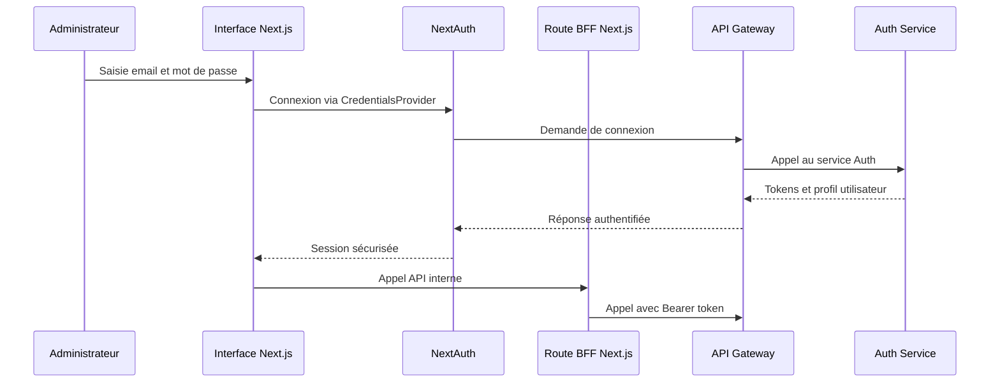
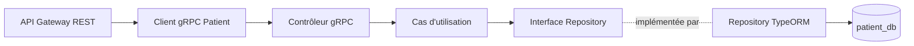
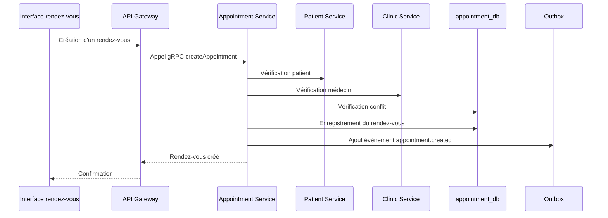
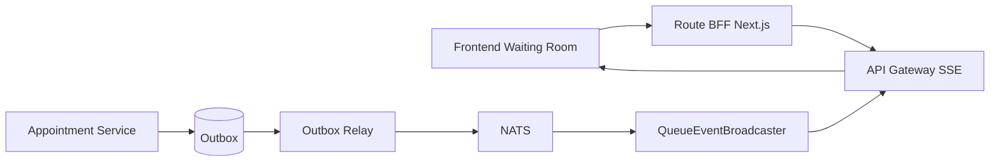
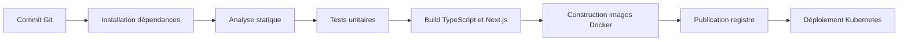
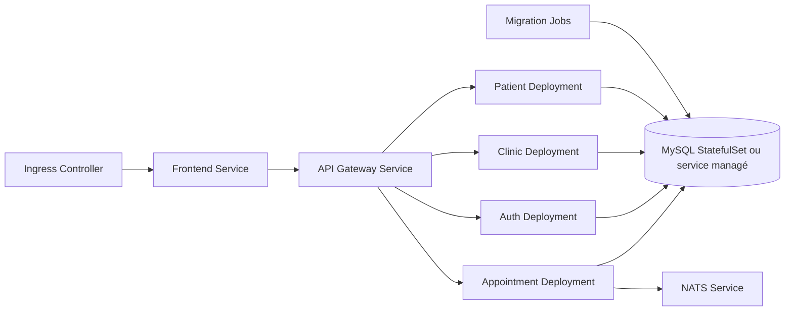
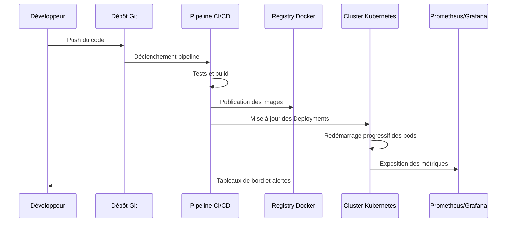

# Chapitre 4

# Implémentation des fonctionnalités métier de DentiFlow

## Introduction

Après la conception de l'architecture générale de DentiFlow, ce chapitre présente la phase de réalisation des principales fonctionnalités métier de la plateforme. L'objectif n'est plus seulement de décrire les choix techniques, mais de montrer comment ces choix ont été concrètement appliqués dans le code source du projet.

La réalisation de DentiFlow a été organisée autour de modules fonctionnels correspondant au fonctionnement réel d'un cabinet dentaire : authentification, gestion des patients, gestion du personnel, rendez-vous, salle d'attente en temps réel et suivi des traitements dentaires. Chaque module respecte les principes définis précédemment : séparation des responsabilités, Clean Architecture, API Gateway, communication gRPC entre services, événements NATS et interface web Next.js.

Dans ce chapitre, nous présentons deux sprints de réalisation. Le premier est consacré aux fonctionnalités de base nécessaires à l'administration du cabinet et à la gestion des dossiers patients. Le second se concentre sur les opérations quotidiennes : rendez-vous, file d'attente, synchronisation en temps réel et module de traitement dentaire.

## 1. Sprint 3

### 1.1 Backlog du troisième sprint

Le troisième sprint avait pour objectif de transformer le socle technique en fonctionnalités utilisables par les utilisateurs internes du cabinet. Les tâches principales sont présentées dans le tableau suivant.

| ID | Tâche | Estimation |
| --- | --- | --- |
| 1 | En tant qu'administrateur, je veux m'authentifier de manière sécurisée afin d'accéder au tableau de bord. | 4 jours |
| 2 | En tant que système, je veux gérer les tokens JWT et refresh tokens afin de sécuriser les appels aux microservices. | 4 jours |
| 3 | En tant que secrétaire, je veux créer, modifier, rechercher et supprimer des patients afin de gérer les dossiers du cabinet. | 6 jours |
| 4 | En tant que secrétaire, je veux gérer les informations d'assurance et les documents des patients. | 5 jours |
| 5 | En tant qu'administrateur, je veux gérer le personnel de la clinique afin d'organiser les rôles et les médecins disponibles. | 4 jours |
| 6 | En tant que développeur, je veux connecter les pages frontend aux repositories et aux cas d'utilisation afin d'éviter les données statiques. | 5 jours |

La réalisation de ce sprint peut être regroupée en trois parties :

- implémentation de l'authentification et de la sécurité applicative ;
- implémentation du module patients ;
- implémentation du module personnel et intégration au tableau de bord.

## 2. Implémentation de l'authentification

### 2.1 Authentification côté backend

Le backend utilise un service dédié à l'authentification. Ce service est responsable de l'inscription, de la connexion, de la génération des tokens et du renouvellement de session. Les données utilisateur sont persistées dans la base `auth_db`, ce qui respecte le principe d'isolation des données par microservice.

Le service d'authentification est organisé en couches :

| Couche | Rôle |
| --- | --- |
| Domaine | Entité utilisateur, rôles et contrat du repository |
| Application | Cas d'utilisation de connexion, inscription et refresh token |
| Infrastructure | Repository TypeORM, mapping utilisateur, adaptateur JWT |
| Présentation | Contrôleur gRPC exposant les opérations d'authentification |

Cette organisation permet de garder la logique métier indépendante du protocole utilisé. Le service peut ainsi exposer ses opérations à l'API Gateway sans dépendre directement du frontend.

### 2.2 Authentification côté frontend

Le frontend utilise NextAuth pour gérer la session utilisateur côté application web. Lorsqu'un administrateur saisit ses identifiants, l'interface appelle le cas d'utilisation `AdminLogin`, qui transmet la demande à l'API Gateway. La réponse contient le profil utilisateur, le rôle, l'identifiant de clinique, l'access token et le refresh token.

Afin d'éviter d'exposer les tokens au navigateur, DentiFlow utilise une route BFF dans Next.js. Cette route lit la session côté serveur et transfère les appels vers l'API Gateway avec le token approprié. Si le token backend arrive à expiration, le BFF appelle l'endpoint de refresh et met à jour le cookie de session.



Cette approche améliore la sécurité car l'access token backend reste manipulé côté serveur. Elle simplifie également les appels depuis les composants React, qui utilisent simplement les repositories applicatifs.

### 2.3 Protection des routes

Les routes backend sensibles sont protégées au niveau de l'API Gateway par des guards NestJS. Les principaux contrôles appliqués sont :

- vérification du JWT ;
- contrôle du rôle utilisateur ;
- vérification du périmètre clinique ;
- refus des accès lorsque le `clinicId` demandé ne correspond pas au token ;
- propagation d'erreurs cohérentes vers le frontend.

Ce mécanisme est essentiel pour DentiFlow, car un utilisateur d'une clinique ne doit jamais pouvoir consulter ou modifier les données d'une autre clinique.

## 3. Implémentation du module patients

### 3.1 Objectif du module

Le module patients permet de gérer le dossier administratif et médical de base d'un patient. Il couvre les informations personnelles, la recherche, la pagination, les assurances, les documents et les opérations de suppression logique.

Les principales fonctionnalités réalisées sont :

- création d'un patient ;
- modification des informations personnelles ;
- recherche par nom ;
- liste paginée et filtrée ;
- suppression définitive ou suppression logique ;
- restauration d'un patient supprimé logiquement ;
- gestion des fournisseurs d'assurance ;
- gestion des modèles d'assurance ;
- affectation d'une assurance à un patient ;
- gestion des documents patient.

### 3.2 Réalisation backend

Le backend du module patient est implémenté dans `patient-service`. Le service expose des contrôleurs gRPC spécialisés afin de séparer les responsabilités.

| Contrôleur gRPC | Responsabilité |
| --- | --- |
| PatientGrpcController | CRUD patient, recherche, suppression logique, restauration |
| InsuranceProviderGrpcController | Gestion des organismes d'assurance |
| InsuranceTemplateGrpcController | Gestion des modèles d'assurance |
| PatientInsuranceGrpcController | Gestion des assurances affectées aux patients |
| PatientDocumentGrpcController | Gestion des documents patient |

Cette séparation rend le service plus maintenable qu'un contrôleur unique contenant toutes les routes. Chaque contrôleur se limite à un sous-domaine fonctionnel.

Le flux interne d'une opération patient suit le schéma suivant.



Les cas d'utilisation, comme la gestion des patients, ne manipulent pas directement TypeORM. Ils passent par des interfaces de repository, ce qui respecte le principe d'inversion de dépendance.

### 3.3 Réalisation API Gateway

L'API Gateway expose les endpoints REST consommés par le frontend. Elle traduit les requêtes HTTP en appels gRPC vers le patient-service.

La base des routes est organisée autour du contexte clinique :

```text
/api/v1/clinics/:clinicId/patients
/api/v1/clinics/:clinicId/insurance-providers
/api/v1/clinics/:clinicId/insurance-templates
/api/v1/clinics/:clinicId/patient-insurance
/api/v1/clinics/:clinicId/patient-documents
```

Cette organisation rend le périmètre clinique explicite dans les URLs. Elle facilite également l'application des guards de sécurité.

### 3.4 Réalisation frontend

Côté frontend, le module patient respecte les mêmes couches que l'architecture globale :

| Couche | Exemple dans le module patient |
| --- | --- |
| Domaine | Entités `Patient`, `InsuranceProvider`, `PatientDocument` |
| Application | Cas d'utilisation `CreatePatient`, `UpdatePatient`, `SearchPatients` |
| Infrastructure | Repositories HTTP, DTOs, mappers |
| Présentation | Page patient, tableau, tiroir de formulaire, filtres, pagination |

La page patient utilise un store Zustand pour gérer les états de chargement, les erreurs, les listes, la pagination et les actions utilisateur. Les appels HTTP ne sont donc pas déclenchés directement dans les composants visuels. Les composants se limitent à afficher les données et à déclencher des actions.

Les fonctionnalités principales de l'interface sont :

- affichage sous forme de tableau ou de grille ;
- recherche et filtres ;
- formulaire latéral de création et modification ;
- gestion des assurances ;
- gestion des documents ;
- pagination ;
- notifications de succès ou d'erreur.

## 4. Implémentation du module personnel

Le module personnel permet à l'administrateur de gérer les membres du cabinet : médecins, assistants, secrétaires et administrateurs. Cette fonctionnalité est importante car les rendez-vous doivent être associés à un docteur, et les droits d'accès dépendent du rôle de chaque utilisateur.

Côté frontend, le module est organisé autour :

- d'une entité `Staff` ;
- de commandes de création et de mise à jour ;
- d'un repository staff ;
- d'un store Zustand ;
- d'une page d'administration avec cartes, filtres et formulaire.

Le module personnel est également utilisé indirectement par le module rendez-vous, car le calendrier doit charger la liste des médecins disponibles.

## 5. Sprint 4

### 5.1 Backlog du quatrième sprint

Le quatrième sprint avait pour objectif d'implémenter les fonctionnalités opérationnelles utilisées quotidiennement par le cabinet.

| ID | Tâche | Estimation |
| --- | --- | --- |
| 1 | En tant que secrétaire, je veux créer et déplacer des rendez-vous afin de gérer le planning du cabinet. | 6 jours |
| 2 | En tant que système, je veux empêcher les conflits de rendez-vous pour un même médecin. | 3 jours |
| 3 | En tant que secrétaire, je veux enregistrer l'arrivée d'un patient afin de l'ajouter à la salle d'attente. | 4 jours |
| 4 | En tant que médecin, je veux voir les changements de la salle d'attente en temps réel. | 5 jours |
| 5 | En tant que médecin, je veux visualiser et saisir les traitements dentaires sur un schéma dentaire. | 7 jours |
| 6 | En tant que développeur, je veux valider les flux principaux avec des tests et des scripts de vérification. | 4 jours |

## 6. Implémentation du module rendez-vous

### 6.1 Réalisation backend

Le module rendez-vous est implémenté dans `appointment-service`. Il gère les rendez-vous, le planning et les entrées de file d'attente. Avant la création d'un rendez-vous, le service vérifie plusieurs conditions :

- le patient existe ;
- le patient appartient à la clinique demandée ;
- le médecin appartient à la même clinique ;
- le médecin possède bien le rôle de docteur ;
- le créneau demandé n'entre pas en conflit avec un autre rendez-vous ;
- les urgences peuvent être traitées selon une règle spécifique.

Le service communique avec `patient-service` et `clinic-service` par gRPC afin de valider les informations nécessaires sans accéder directement à leurs bases de données.



### 6.2 Réalisation frontend

Côté frontend, le module rendez-vous utilise un calendrier interactif basé sur FullCalendar. L'utilisateur peut :

- consulter le planning ;
- filtrer par médecin ;
- rechercher un patient ;
- créer un rendez-vous ;
- modifier un rendez-vous ;
- déplacer un rendez-vous dans le calendrier ;
- enregistrer l'arrivée du patient.

Le store `appointmentStore` centralise les données du calendrier, la liste des médecins, les résultats de recherche patient et les états de sauvegarde. Les opérations sont déléguées aux cas d'utilisation : création, chargement du calendrier, déplacement et mise à jour.

Cette organisation garde l'interface réactive tout en conservant les règles métier dans les couches appropriées.

## 7. Implémentation de la salle d'attente en temps réel

### 7.1 Objectif fonctionnel

La salle d'attente est une fonctionnalité centrale dans DentiFlow. Elle permet au secrétariat, au médecin et aux assistants de suivre l'état des patients présents dans la clinique.

Les statuts gérés sont notamment :

- patient arrivé ;
- en attente ;
- appelé ;
- installé au fauteuil ;
- terminé ;
- corrigé avec justification si nécessaire.

### 7.2 Réalisation backend

Lorsqu'un patient est enregistré dans la salle d'attente, le service rendez-vous crée une entrée de queue. Chaque changement d'état génère ensuite un événement. Pour fiabiliser la publication des événements, le service utilise un mécanisme d'outbox.

Le principe est le suivant :

1. L'action métier est enregistrée dans la base de données.
2. Un événement est ajouté dans la table outbox.
3. Un service `OutboxRelayService` lit les événements non publiés.
4. Les événements sont publiés dans NATS.
5. Les événements publiés sont marqués comme traités.

Cette approche évite de perdre un événement si la publication NATS échoue au moment exact de l'action métier.

### 7.3 Diffusion temps réel vers le frontend

L'API Gateway s'abonne aux événements NATS liés à la file d'attente :

- `queue.checked_in` ;
- `queue.status.updated` ;
- `queue.notes.updated`.

Ensuite, elle diffuse ces événements au navigateur avec SSE. Chaque flux SSE est filtré par `clinicId`, et l'API Gateway vérifie que le `clinicId` demandé correspond au token de l'utilisateur.



Côté frontend, un hook `useQueueStream` ouvre une connexion `EventSource` vers l'API BFF. À chaque événement reçu, le payload est transformé en entité domaine, puis appliqué dans le store de la file d'attente.

Cette architecture permet aux écrans ouverts dans la clinique de recevoir les changements sans rafraîchissement manuel.

## 8. Implémentation du module traitements dentaires

### 8.1 Objectif du module

Le module traitements permet au médecin ou à l'assistant de visualiser les dents du patient, d'ajouter des actes, de gérer les diagnostics et de suivre l'avancement des traitements.

Le module s'appuie sur la notation dentaire FDI. Les dents adultes sont organisées par quadrants :

- supérieur droit : 18 à 11 ;
- supérieur gauche : 21 à 28 ;
- inférieur gauche : 31 à 38 ;
- inférieur droit : 41 à 48.

### 8.2 Fonctionnalités réalisées

L'interface de traitement permet :

- sélection d'une dent ;
- sélection de plusieurs dents ;
- sélection de toute la bouche ;
- choix des surfaces dentaires ;
- ajout d'un acte dentaire ;
- ajout d'un diagnostic ;
- visualisation des actes planifiés ;
- suivi des actes en cours ;
- finalisation d'un acte ;
- affichage de l'historique lié aux dents sélectionnées.

Le module contient également un catalogue d'actes dentaires comme les consultations, radiographies, détartrages, traitements canalaires, extractions, couronnes et implants.

### 8.3 Interface 3D et expérience utilisateur

Le projet contient un modèle 3D `Teeth.glb` et des composants basés sur Three.js et React Three Fiber. Cette approche permet de préparer une visualisation plus riche du schéma dentaire, au-delà d'un simple tableau.

L'objectif est de rendre le dossier de traitement plus naturel pour un praticien dentaire. Au lieu de saisir uniquement des lignes administratives, le médecin peut associer un acte à une dent ou à une surface spécifique.

## 9. Persistance et migrations

La réalisation backend s'appuie sur TypeORM et des migrations versionnées. Chaque service possède ses propres migrations :

| Service | Exemples de migrations |
| --- | --- |
| auth-service | création de la table utilisateurs |
| clinic-service | création des tables clinique, personnel et horaires |
| patient-service | création des tables patients, assurances et documents |
| appointment-service | création des tables rendez-vous, file d'attente et outbox |

Les bases de données sont créées au démarrage de MySQL à travers un script d'initialisation. Les bases principales sont :

- `auth_db` ;
- `clinic_db` ;
- `patient_db` ;
- `appointment_db`.

Cette structure respecte le modèle Database-per-Service. Les services ne consultent pas directement la base d'un autre service.

## 10. Tests et validation

La validation du projet s'appuie sur plusieurs niveaux :

- tests unitaires Jest côté frontend ;
- tests unitaires et d'intégration côté services NestJS ;
- tests des cas d'utilisation ;
- tests des contrôleurs gRPC ;
- scripts de test des endpoints patient ;
- compilation TypeScript des services ;
- vérification manuelle des flux principaux via Docker Compose.

Le rapport de test du patient-service confirme notamment :

- la séparation des contrôleurs patients ;
- l'exposition des endpoints REST via l'API Gateway ;
- la compilation du patient-service et de l'API Gateway ;
- la validation des opérations CRUD ;
- la gestion des assurances et documents ;
- la protection par rôles et périmètre clinique.

## 11. Conclusion

Dans ce chapitre, nous avons présenté l'implémentation des principales fonctionnalités métier de DentiFlow. Le projet passe d'une architecture définie à une application fonctionnelle couvrant l'authentification, les patients, le personnel, les rendez-vous, la salle d'attente en temps réel et le suivi des traitements dentaires.

La réalisation confirme les choix du chapitre précédent : la Clean Architecture facilite l'organisation du code, l'API Gateway centralise la sécurité, gRPC structure les échanges synchrones, NATS permet la diffusion d'événements et SSE rend les mises à jour visibles en temps réel dans le navigateur.

# Chapitre 5

# Gestion d'intégration continue et déploiement DevOps

## Introduction

Ce chapitre présente l'approche DevOps prévue pour DentiFlow. Après la réalisation des fonctionnalités métier, il est nécessaire de préparer un environnement de déploiement fiable, reproductible et observable.

Le projet utilise déjà Docker pour conteneuriser le frontend, l'API Gateway et les microservices backend. Pour l'environnement de production, l'approche retenue repose sur Kubernetes pour l'orchestration, Prometheus pour la collecte des métriques et Grafana pour la visualisation de l'état de la plateforme.

## 1. Backlog du cinquième sprint

| ID | Tâche | Estimation |
| --- | --- | --- |
| 1 | En tant que développeur, je veux construire des images Docker pour chaque service afin de préparer le déploiement. | 3 jours |
| 2 | En tant que développeur, je veux exécuter les migrations de base de données avant le démarrage des services. | 3 jours |
| 3 | En tant qu'équipe DevOps, je veux déployer les services dans Kubernetes afin d'assurer l'orchestration et la scalabilité. | 5 jours |
| 4 | En tant qu'équipe DevOps, je veux configurer Prometheus afin de surveiller les services. | 3 jours |
| 5 | En tant qu'équipe DevOps, je veux créer des tableaux de bord Grafana afin de suivre la santé de DentiFlow. | 3 jours |
| 6 | En tant que développeur, je veux automatiser les tests, le build et le déploiement afin de réduire les erreurs manuelles. | 5 jours |

## 2. Conteneurisation avec Docker

Chaque partie de DentiFlow possède son image Docker :

- image frontend Next.js ;
- image API Gateway ;
- image auth-service ;
- image clinic-service ;
- image patient-service ;
- image appointment-service ;
- image migrations.

Le fichier `docker-compose.dev.yml` facilite le développement local avec hot reload, MySQL et NATS. Le fichier `docker-compose.prod.yml` prépare une exécution plus proche de la production avec images dédiées, variables d'environnement, health checks et jobs de migration.

Les migrations sont séparées du démarrage des services. Cette séparation permet d'exécuter les modifications de schéma avant de lancer les applications, ce qui réduit les risques d'erreurs au démarrage.

## 3. Pipeline d'intégration continue

Le pipeline DevOps suit les étapes classiques d'intégration continue :



Les étapes principales sont :

| Étape | Rôle |
| --- | --- |
| Installation | Installer les dépendances pnpm du monorepo |
| Lint | Vérifier les règles de qualité du code |
| Test | Exécuter les tests frontend et backend |
| Build | Compiler le frontend et les services |
| Docker build | Construire les images applicatives |
| Push | Publier les images dans un registre |
| Deploy | Mettre à jour les workloads Kubernetes |

Cette automatisation permet de détecter rapidement les erreurs avant le déploiement.

## 4. Déploiement Kubernetes

### 4.1 Architecture logique Kubernetes

Kubernetes est utilisé pour orchestrer les conteneurs DentiFlow. Chaque composant applicatif est représenté par un Deployment ou un Job.



Les objets Kubernetes prévus sont :

- `Namespace` pour isoler l'environnement DentiFlow ;
- `Deployment` pour le frontend, la Gateway et les microservices ;
- `Service` pour exposer les communications internes ;
- `Ingress` pour exposer le frontend et l'API Gateway ;
- `ConfigMap` pour les paramètres non sensibles ;
- `Secret` pour les mots de passe, clés JWT et secrets NextAuth ;
- `Job` pour les migrations TypeORM ;
- `StatefulSet` ou service managé pour MySQL ;
- `HorizontalPodAutoscaler` pour adapter le nombre de pods selon la charge.

### 4.2 Stratégie de déploiement

La stratégie retenue consiste à déployer progressivement les services :

1. déploiement de MySQL et NATS ;
2. exécution des jobs de migration ;
3. démarrage des microservices backend ;
4. démarrage de l'API Gateway ;
5. démarrage du frontend ;
6. vérification des endpoints de santé ;
7. activation du trafic via Ingress.

Cette séquence évite que l'API Gateway ou le frontend démarrent avant les services nécessaires.

## 5. Observabilité avec Prometheus et Grafana

### 5.1 Prometheus

Prometheus est utilisé pour collecter les métriques techniques et applicatives. Dans DentiFlow, les métriques importantes sont :

- disponibilité des pods ;
- consommation CPU et mémoire ;
- latence HTTP de l'API Gateway ;
- taux d'erreur HTTP ;
- disponibilité des services gRPC ;
- état de MySQL ;
- état de NATS ;
- nombre d'événements de file d'attente publiés ;
- délai moyen de publication des événements outbox ;
- nombre de connexions SSE actives.

Prometheus peut être intégré à Kubernetes à travers des `ServiceMonitor` ou une configuration de scrape. Les endpoints de santé déjà présents dans les services constituent une première base pour vérifier la disponibilité.

### 5.2 Grafana

Grafana permet de créer des tableaux de bord pour visualiser l'état de la plateforme. Les dashboards utiles pour DentiFlow sont :

| Dashboard | Indicateurs suivis |
| --- | --- |
| Vue globale | état des pods, disponibilité, redémarrages |
| API Gateway | latence, erreurs, trafic par endpoint |
| Microservices | CPU, mémoire, temps de réponse gRPC |
| Base de données | connexions MySQL, erreurs, temps de requête |
| Temps réel | événements NATS, connexions SSE, délai de propagation |
| Métier | rendez-vous créés, patients en file d'attente, statuts traités |

Ces tableaux de bord permettent de détecter rapidement un problème et d'évaluer l'impact sur les utilisateurs du cabinet.

## 6. Gestion des secrets et configuration

La configuration de production contient plusieurs valeurs sensibles :

- `MYSQL_ROOT_PASSWORD` ;
- `JWT_SECRET` ;
- `REFRESH_TOKEN_SECRET` ;
- `NEXTAUTH_SECRET` ;
- URL interne de l'API Gateway ;
- URL publique du frontend ;
- configuration des bases de données.

En Kubernetes, ces valeurs doivent être placées dans des `Secret`, tandis que les paramètres non sensibles peuvent être placés dans des `ConfigMap`. Cette séparation évite d'écrire les secrets directement dans les fichiers de déploiement.

## 7. Démonstration logique du déploiement

Le flux logique d'un déploiement est le suivant :



## 8. Conclusion

Dans ce chapitre, nous avons présenté l'approche DevOps de DentiFlow. La conteneurisation Docker permet de standardiser l'exécution des services. Kubernetes apporte l'orchestration, la scalabilité et la gestion des déploiements. Prometheus et Grafana complètent l'architecture en offrant une visibilité sur l'état technique et métier de la plateforme.

Cette approche prépare DentiFlow à un déploiement plus professionnel, capable de supporter plusieurs services, de surveiller les incidents et d'accompagner l'évolution progressive du produit vers une plateforme SaaS.
